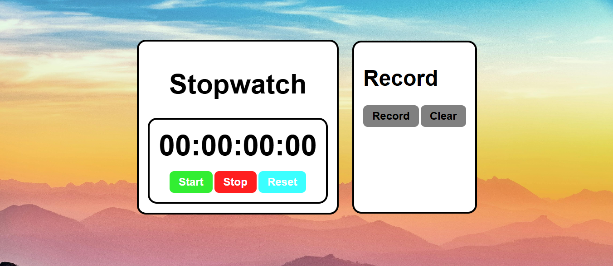
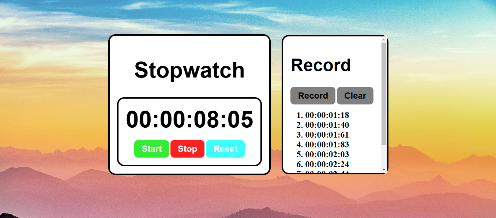
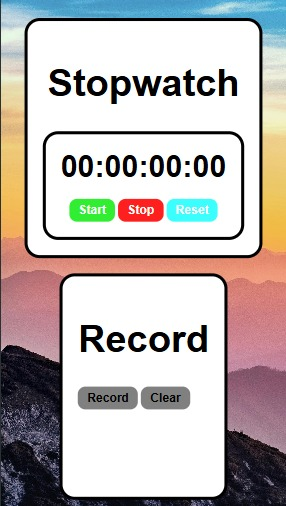

# Stopwatch

A simple stopwatch web application built using HTML, CSS, and JavaScript. The stopwatch allows users to start, stop, reset, and record lap times.

## Features

- **Accurate Stopwatch:** Measures time elapsed with precision (typically milliseconds).
- **Start, Stop, and Reset Functionality:** Intuitive buttons to control the stopwatch.
- **Lap Timing:** Ability to record individual lap times while the stopwatch is running.
- **Responsive Design:** The layout adjusts fluidly to various screen sizes (desktops, tablets, and mobile devices) thanks to responsive CSS techniques (e.g., media queries).
- **Record Board:** A dedicated section to display the recorded lap times in a clear and organized manner.
- **Clear Lap Records:** Each recorded lap shows its sequential number and the time taken.
- **User-Friendly Interface:** Clean and simple design for ease of use.

## Technologies Used

- HTML
- CSS
- JavaScript

## How to Use

1. Click the **Start** button to begin timing.
2. Click the **Stop** button to pause the stopwatch.
3. Click the **Reset** button to reset the timer.
4. Click the **Record** button to save the current time.
5. Click the **Clear** button to remove all recorded times.

## Screenshots





## Installation

1. Clone the repository:
   ```bash
   git clone https://github.com/yourusername/stopwatch-project.git
   ```
