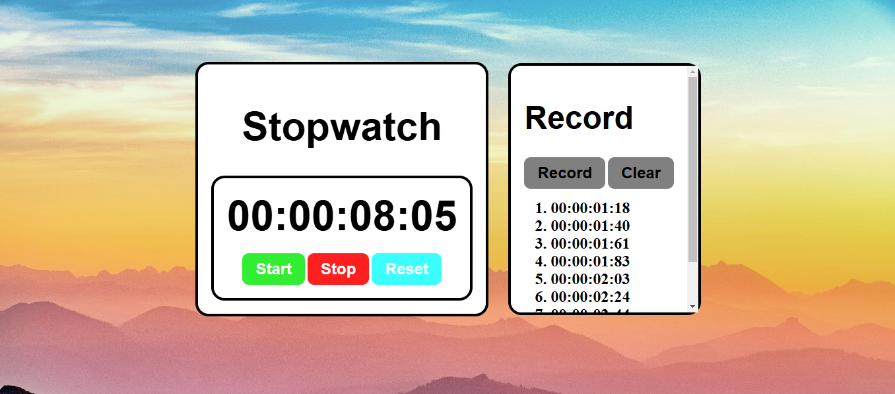

# Stopwatch Project

A simple stopwatch web application built using HTML, CSS, and JavaScript. The stopwatch allows users to start, stop, reset, and record lap times.



## Features
- Start, stop, and reset functionality
- Lap time recording
- Clear recorded times

## Technologies Used
- HTML
- CSS
- JavaScript

## How to Use
1. Click the **Start** button to begin timing.
2. Click the **Stop** button to pause the stopwatch.
3. Click the **Reset** button to reset the timer.
4. Click the **Record** button to save the current time.
5. Click the **Clear** button to remove all recorded times.

## Installation
1. Clone the repository:
   ```bash
   git clone https://github.com/yourusername/stopwatch-project.git
   ```

## Contributing
Feel free to fork this repository and submit pull requests with improvements or new features.

## License
This project is open-source and available under the MIT License.
